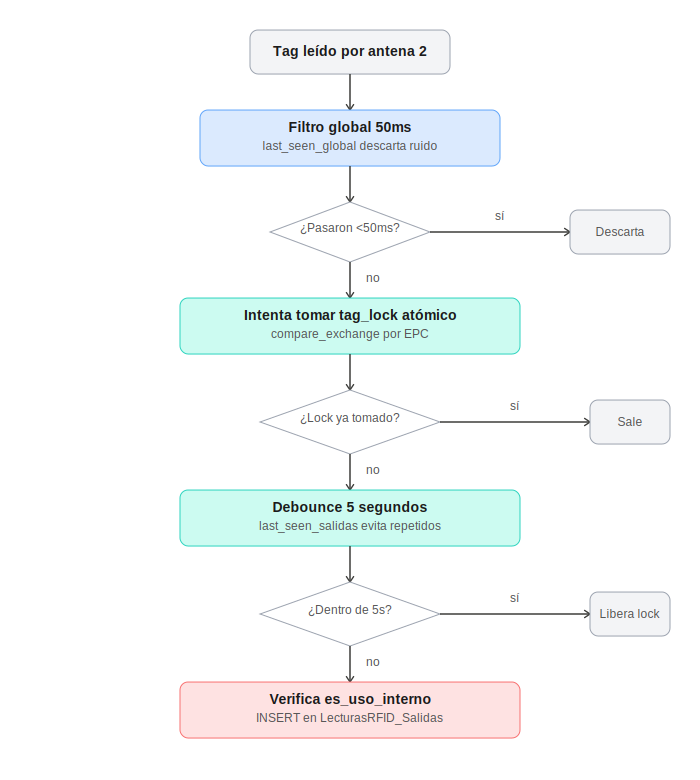
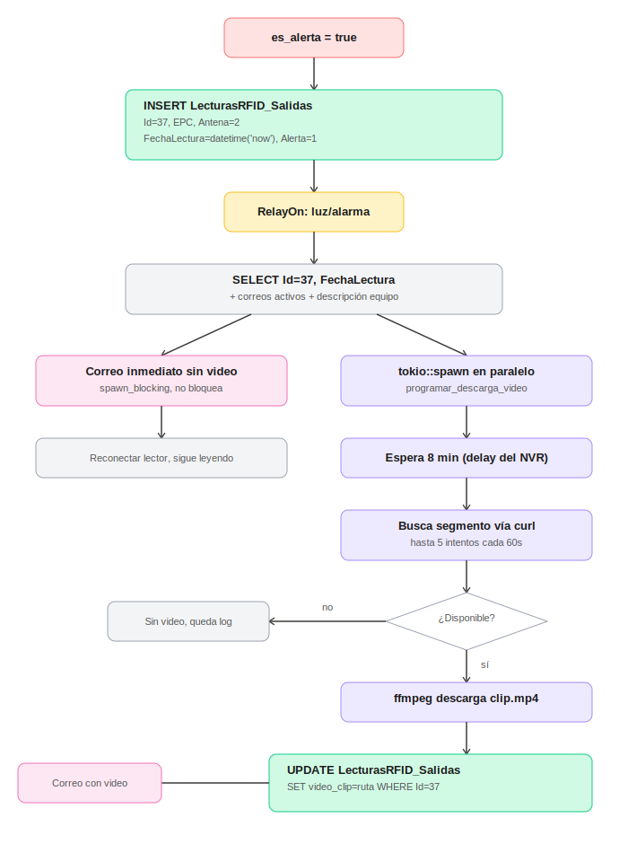

# Documentación: Integración RFID + NVR Hikvision + Notificaciones por Correo

**Proyecto:** Sistema de detección de salida de equipos con captura de video y alertas automáticas
**Stack:** Tauri (Rust) + SQLite + RTSP/ISAPI Hikvision + ffmpeg + Gmail SMTP
**Última actualización:** Junio 2026

---

## 1. Resumen ejecutivo

El sistema detecta, mediante un lector RFID UHF con antenas fijas, cuándo un equipo etiquetado pasa por la antena de salida. Si el equipo está marcado como "Uso Interno" (no debería salir), el sistema:

1. Activa un relay físico (luz/alarma).
2. Envía un correo de alerta inmediato (sin video).
3. En segundo plano, busca y descarga el(los) clip(s) de video del NVR Hikvision correspondientes al momento exacto del evento, desde varias cámaras.
4. Envía un segundo correo con los videos adjuntos.

Todo el flujo corre dentro de una app de escritorio construida con **Tauri** (frontend web + backend Rust), con persistencia local en **SQLite** y sincronización opcional contra un SQL Server remoto.

---

## 2. Arquitectura general

```
┌─────────────┐      TCP       ┌──────────────────┐
│ Lector RFID │ ──────────────▶│  App Tauri (Rust)│
│ (antenas)   │                │  iniciar_lectura  │
└─────────────┘                └─────────┬─────────┘
                                          │
                  ┌───────────────────────┼───────────────────────┐
                  ▼                       ▼                       ▼
          ┌───────────────┐      ┌────────────────┐      ┌─────────────────┐
          │ SQLite local  │      │  Relay (TCP)   │      │  NVR Hikvision  │
          │ app.db        │      │  Luz / Alarma  │      │  curl + ffmpeg  │
          └───────────────┘      └────────────────┘      └─────────────────┘
                  │                                                │
                  ▼                                                ▼
          ┌───────────────┐                              ┌─────────────────┐
          │  SQL Server   │                              │  Correo Gmail   │
          │  (sync)       │                              │  (lettre SMTP)  │
          └───────────────┘                              └─────────────────┘
```

---

## 3. Flujo completo: detección y prevención de duplicados

Los lectores RFID UHF hacen "inventario continuo" — pueden reportar el mismo tag decenas de veces por segundo mientras permanece en el rango de la antena. El sistema usa **tres capas independientes** para garantizar que cada salida real dispare exactamente un correo y una búsqueda de video, sin duplicados.



### Capa 1 — Filtro global de 50ms (`last_seen_global`)

Descarta lecturas del mismo EPC que llegan con menos de 50ms de diferencia respecto a la anterior. Esto frena el "ruido" inmediato del lector, pero no es suficiente solo (en 1 segundo completo deja pasar hasta ~20 veces).

### Capa 2 — Lock atómico por EPC (`relay_locks` + `AtomicBool`)

```rust
let tag_lock = locks.entry(epc_clone.clone())
    .or_insert_with(|| Arc::new(AtomicBool::new(false)))
    .clone();

if tag_lock.compare_exchange(false, true, Ordering::SeqCst, Ordering::SeqCst).is_err() {
    return; // otra tarea ya tiene el lock para este EPC -> salir
}
```

La primera lectura que llega "cierra la puerta" con `compare_exchange`. Todas las lecturas del mismo EPC que llegan mientras la puerta está cerrada simplemente salen sin hacer nada — sin insertar en BD, sin correo, sin video. El lock se libera 10 segundos después de procesar el evento.

### Capa 3 — Debounce de 5 segundos (`last_seen_salidas`)

```rust
if now.duration_since(last) < Duration::from_secs(5) {
    false // dentro del cooldown de 5s, no procesar
} else {
    salidas.insert(epc_clone.clone(), now);
    true
}
```

Solo la verifica la tarea que sí logró tomar el lock. Sirve para el caso de que el tag pase, se vaya, y vuelva a pasar pocos segundos después (la persona duda y regresa) — no genera una segunda alerta dentro de esa ventana de 5 segundos.

> **Hallazgo de campo:** en pruebas reales se observó que si la persona permanece más de 5 segundos cerca de la antena (por ejemplo yendo y viniendo), cada reaparición después de ese umbral se cuenta como un evento nuevo legítimo — generando múltiples correos y búsquedas de video independientes. Esto es el comportamiento esperado del diseño actual; si se prefiere agrupar eventos cercanos como uno solo, basta con aumentar el valor de 5 segundos (por ejemplo a 30-60s).

---

## 4. Flujo de alerta: correo inmediato + captura de video diferida



### Paso a paso

1. **`es_alerta = true`** — se confirma que el EPC corresponde a un equipo marcado `TIPO_PRODUCTO = 'Uso Interno'` en la tabla `EQUIPOS_GLEF`.
2. **INSERT en `LecturasRFID_Salidas`** — se registra el evento con `FechaLectura = datetime('now')` (ver sección 6 sobre zona horaria), `Alerta = 1`.
3. **RelayOn** — se activa el relay físico (luz/alarma) de inmediato.
4. **SELECT del registro recién insertado** — se recupera `Id`, `FechaLectura`, descripción del equipo y lista de correos activos.
5. **Correo inmediato sin video** — se envía vía `tokio::task::spawn_blocking` (porque `lettre` es síncrono), sin bloquear el resto del flujo.
6. **`tokio::spawn(programar_descarga_video(...))`** — se lanza en paralelo, completamente independiente del flujo principal (que sigue con la reconexión del lector RFID).
7. Dentro de esa tarea en paralelo:
   - Espera el delay configurado (`CLIP_DELAY_INICIAL_SEGS`, recomendado 480s / 8 min — ver sección 5).
   - Busca disponibilidad del segmento en el NVR (`buscar_segmento_nvr`, vía `curl --digest`), con reintentos.
   - Si encuentra, descarga el clip con `ffmpeg` (`descargar_clip_nvr`).
   - **UPDATE en `LecturasRFID_Salidas`** — guarda la(s) ruta(s) del clip en la columna `video_clip`.
   - Envía el **segundo correo**, esta vez con el video adjunto.

### Captura multi-cámara (actualización reciente)

El NVR está vinculado a 9 cámaras, de las cuales 5 producen video utilizable (101, 301, 401, 601, 901 — las otras 4 solo muestran el logo de Hikvision, posiblemente desconectadas o sin señal). El sistema fue extendido para:

- Configurar varias cámaras vía `.env`: `NVR_TRACKS=101,301,401,601,901`
- Buscar disponibilidad en **todas** las cámaras configuradas, con reintentos independientes por cámara (una cámara puede estar disponible en el intento 1 mientras otra recién aparece en el intento 3).
- Descargar **en paralelo** (`futures::future::join_all`) todas las cámaras que sí tuvieron segmento disponible.
- Tolerar fallos parciales: si 3 de 5 cámaras tienen video disponible, se envía el correo con esas 3, sin bloquear todo por las 2 faltantes.
- Guardar todas las rutas en la misma columna `video_clip`, separadas por `;` (decisión deliberada para mantener el esquema simple; ver sección 7 sobre mejoras futuras).

---

## 5. Hallazgos críticos sobre el NVR Hikvision

### 5.1 Endpoints ISAPI utilizados

| Endpoint | Método | Propósito |
|---|---|---|
| `/ISAPI/Streaming/channels` | GET | Lista de canales y su configuración de stream |
| `/ISAPI/ContentMgmt/record/tracks` | GET | Tracks de grabación reales (uno por canal: 101, 201, 301...) |
| `/ISAPI/ContentMgmt/search` | POST | Buscar segmentos grabados en un rango de tiempo |
| `/ISAPI/ContentMgmt/download` | POST | Descarga el **archivo completo** del segmento (no recorta por tiempo — no usado en producción) |
| `/ISAPI/ContentMgmt/Storage` | GET | Estado del disco (capacidad, espacio libre, modo de gestión) |
| `/ISAPI/System/time` | GET | Hora y zona horaria configurada en el NVR |
| `/ISAPI/System/capabilities` | GET | Capacidades soportadas por el dispositivo |

Autenticación: **Digest**, vía `curl --digest -u user:pass`.

### 5.2 Formato del XML de búsqueda

```xml
<?xml version="1.0" encoding="UTF-8"?>
<CMSearchDescription>
  <searchID>11111111-2222-3333-4444-555555555555</searchID>
  <trackIDList>
    <trackID>101</trackID>
  </trackIDList>
  <timeSpanList>
    <timeSpan>
      <startTime>2026-06-18T15:00:00</startTime>
      <endTime>2026-06-18T15:00:10</endTime>
    </timeSpan>
  </timeSpanList>
  <maxResults>5</maxResults>
  <searchResultPostion>0</searchResultPostion>
</CMSearchDescription>
```

**Importante:** el `searchID` debe tener formato UUID válido. Un valor de texto plano simple (ej. `"TEST-001"`) provocó el error `Invalid XML Content / two root tags` en el NVR real — aunque el XML enviado era válido, el NVR rechazó la petición completa.

### 5.3 Descarga eficiente del clip — el comando definitivo

```bash
ffmpeg -rtsp_transport tcp \
  -timeout 5000000 \
  -i "rtsp://user:pass@IP/Streaming/tracks/{track}/?starttime=YYYYMMDDTHHMMSSZ&endtime=YYYYMMDDTHHMMSSZ" \
  -t {duracion_segundos} \
  -c:v copy -an \
  salida.mp4
```

Piezas clave descubiertas por prueba y error:

- **`-timeout 5000000`** (microsegundos = 5s): el NVR no cierra la sesión RTSP limpiamente al llegar al `endtime` solicitado — sin este timeout, ffmpeg se queda esperando indefinidamente (se observaron casos de 10+ minutos colgado para un clip de 30 segundos).
- **`-t {duracion}`**: corta exactamente la duración pedida por el lado del cliente, sin depender de que el NVR cierre el stream.
- **`-c:v copy`**: copia el video sin recodificar (rápido). El audio (`G.711 ulaw / pcm_mulaw`) **no es compatible con contenedor MP4** directamente — usar `-an` (sin audio) o `-c:a aac` si se necesita audio, o usar contenedor `.mkv` que acepta cualquier codec sin recodificar.
- El endpoint `/ISAPI/ContentMgmt/download` fue descartado para producción: descarga el **segmento completo** (cientos de MB / hasta 700MB+), ignorando el rango de tiempo solicitado.

### 5.4 Delay de disponibilidad de grabación

Existe un retraso de **~6 a 8 minutos** entre que ocurre la grabación real y que el segmento queda disponible para `/ISAPI/ContentMgmt/search`. El sistema compensa esto esperando (`CLIP_DELAY_INICIAL_SEGS=480`) antes del primer intento de búsqueda, y reintentando (`CLIP_REINTENTOS=5`, cada `CLIP_INTERVALO_REINTENTO_SEGS=60`) si aún no está disponible.

### 5.5 Estado del almacenamiento

Se detectó que el disco del NVR (2.8TB, modo `quota`) puede llegar a `freeSpace=0`. El sistema sigue grabando en modo cíclico (sobrescribiendo lo más antiguo), pero la **retención efectiva por canal puede ser tan corta como ~20 horas** dependiendo de la cuota asignada por canal. Esto implica que la descarga de evidencia debe ocurrir relativamente pronto después del evento, no días después.

---

## 6. Nota crítica: zona horaria entre SQLite y el NVR

### Estado actual (confirmado, junio 2026)

- `FechaLectura` en `LecturasRFID_Salidas` se guarda con `datetime('now', 'localtime')` -> **hora LOCAL Perú (UTC-5)**.
- El NVR, tras un ajuste manual de hora realizado en el equipo, quedó grabando con timestamps **también en hora LOCAL Perú** (confirmado comparando el timestamp quemado en el video contra `FechaLectura` de un evento real — coincidieron, considerando el margen de `CLIP_MARGEN_ANTES`).
- Como ambos lados coinciden en el mismo huso horario, el código **no realiza ninguna conversión** — usa `FechaLectura` tal cual, directo, como `starttime` para el NVR.

### Por qué esto es inusual y por qué es frágil

Por defecto, los NVR Hikvision graban internamente en **UTC puro**, sin importar el campo `timeZone` visible en `/ISAPI/System/time` (ese campo es solo informativo, para el OSD del video). Esto se confirmó al inicio del proyecto: una captura del DVR mostraba `15:00:08` cuando en Perú eran las 10:00 AM — diferencia de 5 horas, es decir, UTC real.

El comportamiento actual (grabando en hora local) probablemente ocurrió porque, al ajustar manualmente la hora desde la interfaz del NVR, se ingresó la hora local Perú directamente como "hora del sistema", y el firmware la tomó literal sin aplicar conversión a UTC.

### Qué puede romper esto en el futuro

Si el NVR vuelve a su comportamiento UTC "de fábrica" (reinicio, corte de luz prolongado, actualización de firmware, alguien vuelve a tocar la configuración de hora, sincronización NTP), el sistema se desalinea por ~5 horas y los clips descargados no corresponderán al momento real del evento.

### Cómo diagnosticarlo rápido

1. `curl --digest -u admin:PASS http://IP/ISAPI/System/time` -> comparar `<localTime>` contra el reloj real.
2. Generar una alerta, anotar `FechaLectura` exacto.
3. Comparar contra el timestamp quemado en el clip resultante.
4. Si difieren ~5 horas -> el NVR volvió a UTC. Soluciones: (a) re-ajustar el NVR para que vuelva a grabar en hora local, o (b) quitar `'localtime'` del `INSERT` (volver a `datetime('now')` puro), que es lo correcto si el NVR está en UTC.

**Regla de oro:** `FechaLectura` y el reloj de grabación del NVR deben estar en el **mismo** huso horario. No importa cuál (UTC o local) — lo que rompe el sistema es que queden desalineados entre sí.

---

## 7. Esquema de base de datos (SQLite local)


### Tablas principales involucradas en el flujo de alertas

**`EQUIPOS_GLEF`** — catálogo de equipos sincronizado desde SQL Server. La columna `TIPO_PRODUCTO = 'Uso Interno'` es la que determina si una salida dispara alerta.

**`LecturasRFID_Salidas`** — registro de cada salida detectada por la antena 2.
```sql
CREATE TABLE LecturasRFID_Salidas (
    Id           INTEGER PRIMARY KEY AUTOINCREMENT,
    EPC          TEXT NOT NULL,
    Antena       INTEGER,
    FechaLectura TEXT NOT NULL DEFAULT (datetime('now')),
    Alerta       INTEGER NOT NULL DEFAULT 0,
    sincronizado INTEGER NOT NULL DEFAULT 0,
    video_clip   TEXT  -- agregado: rutas de video, separadas por ';' si hay varias cámaras
);
```

**`destinatarios_alerta`** — correos que reciben las notificaciones. No tiene foreign key física con `LecturasRFID_Salidas`; se consulta por separado en cada alerta.

### Ciclo de vida de un registro (ejemplo con Id=37)

1. **INSERT** inicial: `Id=37`, `video_clip` queda `NULL` (columna vacía implícita).
2. Pasan ~8-15 minutos (delay del NVR + reintentos).
3. **UPDATE** sobre el mismo `Id=37`: se rellena `video_clip` con la(s) ruta(s) del clip descargado.

Es clave que se capture el `Id` justo después del INSERT inicial, para poder volver a localizar exactamente ese mismo registro más tarde sin ambigüedad (no se puede asumir que sea "el último" en ese momento, porque pueden ocurrir más eventos mientras se espera el delay).

### Nota sobre el diseño actual de `video_clip` (multi-cámara)

Actualmente todas las rutas de video de un mismo evento se concatenan en un solo string, separadas por `;`, dentro de la misma columna `video_clip`. Es la solución más simple de implementar, pero tiene como desventaja que filtrar/consultar por cámara específica desde SQL requiere parsear ese string en el código de la aplicación.

**Alternativa para una iteración futura** (no implementada aún): una tabla relacional separada:
```sql
CREATE TABLE VideoClips (
    Id          INTEGER PRIMARY KEY AUTOINCREMENT,
    SalidaId    INTEGER NOT NULL,
    Camara      TEXT NOT NULL,
    RutaArchivo TEXT NOT NULL,
    FechaCreado TEXT NOT NULL DEFAULT (datetime('now')),
    FOREIGN KEY (SalidaId) REFERENCES LecturasRFID_Salidas(Id)
);
```
Esto permitiría consultas directas como `SELECT * FROM VideoClips WHERE SalidaId = 47` y facilitaría construir una "galería de videos por evento" en el frontend.

---

## 8. Variables de entorno (`.env`)

```dotenv
# Variables ya existentes (SMTP)
GMAIL_USER=...
GMAIL_PASS=...

# Variables del módulo NVR
NVR_IP=192.168.1.76
NVR_USER=admin
NVR_PASS=********
NVR_TRACKS=101,301,401,601,901
CLIP_DURACION_SEGS=40
CLIP_MARGEN_ANTES=10
CLIP_DELAY_INICIAL_SEGS=480
CLIP_REINTENTOS=5
CLIP_INTERVALO_REINTENTO_SEGS=60
```

| Variable | Significado | Valor recomendado |
|---|---|---|
| `NVR_TRACKS` | Lista de cámaras a capturar, separadas por coma | Solo las que sí producen video (verificar visualmente) |
| `CLIP_DURACION_SEGS` | Duración del clip descargado | 40s |
| `CLIP_MARGEN_ANTES` | Segundos antes del evento que incluye el clip | 10s (ajustar si el evento queda fuera del clip) |
| `CLIP_DELAY_INICIAL_SEGS` | Espera antes del primer intento de búsqueda | 480s (8 min) — cubre el delay típico del NVR |
| `CLIP_REINTENTOS` | Número de intentos de búsqueda por cámara | 5 |
| `CLIP_INTERVALO_REINTENTO_SEGS` | Segundos entre reintentos | 60s |

**Mapeo de cámaras conocido** (a la fecha de este documento):

| Track | Cámara | Estado |
|---|---|---|
| 101 | Cámara 1 | Funcional |
| 201 | Cámara 2 | Sin video (solo logo) |
| 301 | Cámara 3 (Afuera) | Funcional |
| 401 | Cámara 4 (frente a cámara 1) | Funcional |
| 501 | Cámara 5 | Sin video (solo logo) |
| 601 | Cámara 6 (costado de cámara 4) | Funcional |
| 701 | Cámara 7 | Sin video (solo logo) |
| 801 | Cámara 8 | Sin video (solo logo) |
| 901 | Cámara 9 (mejor ángulo) | Funcional |

---

## 9. Proyectos y archivos relacionados

| Proyecto | Propósito |
|---|---|
| `rfid-app-tauri` | App principal en producción (Tauri + Rust), integra RFID, relay, NVR y correo |
| `nvr-clip-downloader` (a.k.a. `nvr-clip-test`) | Proyecto de prueba aislado en Rust, con su propia BD SQLite (`test_nvr.db`), usado para validar la lógica de búsqueda/descarga sin afectar la app real |
| `nvr_simulator.py` | Simulador en Python del endpoint `/ISAPI/ContentMgmt/search` (pendiente: simulador RTSP con MediaMTX) — para probar el flujo completo sin depender del NVR físico |

### Comandos útiles del proyecto de prueba

```bash
cargo run -- insertar <minutos_atras>   # simula un evento "hace N minutos" (UTC real)
cargo run -- listar                     # muestra todos los registros
cargo run -- procesar <id>              # busca y descarga el video de ese registro
```

---

## 10. Pendientes / próximos pasos

- [ ] Confirmar de forma periódica que el NVR sigue alineado en zona horaria con SQLite (ver sección 6) — posible automatización: comparar `/ISAPI/System/time` contra la hora local al iniciar la app, y loguear advertencia si difieren.
- [ ] Decidir si el debounce de 5 segundos debe aumentarse para agrupar eventos cercanos como uno solo (ver sección 3).
- [ ] Completar el simulador de NVR (parte RTSP con MediaMTX) para poder probar el flujo completo sin depender del hardware físico.
- [ ] Evaluar migrar `video_clip` (string con `;`) a una tabla relacional `VideoClips` si se necesita un frontend tipo "galería" por evento.
- [ ] Verificar de forma sistemática, cámara por cámara, cuáles de las 9 producen video utilizable (ya hay un primer mapeo informal en la sección 8, pendiente de confirmación técnica vía captura de frame con ffmpeg).
- [ ] Documentar el comando de captura de un solo frame para verificación rápida de cámaras:
  ```bash
  ffmpeg -rtsp_transport tcp -i "rtsp://user:pass@IP/Streaming/channels/{canal}" -frames:v 1 -y preview.jpg
  ```

---

## Apéndice: comandos de diagnóstico rápido del NVR

```bash
# Listar canales de streaming
curl --digest -u admin:PASS http://IP/ISAPI/Streaming/channels

# Tracks de grabación reales
curl --digest -u admin:PASS http://IP/ISAPI/ContentMgmt/record/tracks

# Estado de almacenamiento
curl --digest -u admin:PASS http://IP/ISAPI/ContentMgmt/Storage

# Hora del NVR
curl --digest -u admin:PASS http://IP/ISAPI/System/time

# Buscar grabacion en un rango (recordar formato UTC con 'Z' si el NVR esta en UTC)
curl --digest -u admin:PASS -X POST -H "Content-Type: application/xml" \
  -d @search_body.xml http://IP/ISAPI/ContentMgmt/search
```


### ALGUNAS CONSIDERACIONES TECNICAS PARA EJECUPAR APP
## Ejecutar
npm install
### Windows
npm run tauri dev
### Android
cargo tauri android dev

## Para generar ejecutable
### Windows
npm install
npm run tauri build
### Android
cargo tauri android build
o 
npm run tauri android dev
